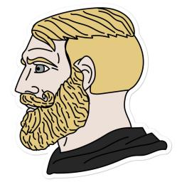

# **:tropical_drink:[Session](https://github.com/oxen-io):tropical_drink:**
# **:cake:[Session Private Groups](/Private.md):cake:**
## Global Freedom Status ##
**[WEB4](https://en.everybodywiki.com/Web4)** \
**[RSF’s 2022 World Freedom Index](https://rsf.org/en/index?year=2022)** \
**[Global Freedom Internet Freedom Democracy Status](https://freedomhouse.org/explore-the-map?type=fiw&year=2022)** \
**[The Global Rule of Law Recession Continues](https://worldjusticeproject.org/rule-of-law-index/)**

*[Radicle is a peer-to-peer stack for building software together. Sound fun? Try it](https://radicle.xyz/)* \
*[decentragit uses decentralized ownership and storage to make it trivial to create a decentralized, shareable git remote of your project.](https://github.com/quorumcontrol/dgit)* \
*[Mango: Git, completely decentralised.](https://github.com/axic/mango)* \
*[A decentralization of GitHub using BitTorrent and Bitcoin](https://github.com/cjb/GitTorrent)*


**[Forever domains are truly decentralized domains with no renewal fees, ever.](https://foreverdomains.io/)** \
**[Awesome Browser Search Engine](https://github.com/GNU-Linux-libre/Awesome-Browser-Search-Engine)** \
**[Awesome VPN Network](https://github.com/GNU-Linux-libre/Awesome-VPN-Network)** 

#


#
A quick lookup from browser `ctrl + f` may help to find communities by a topic
[](#contents)

* Editing Examples
  * src="`image link`"> \

````


*<div align="right"><a href="#Contents">Back to directory :maple_leaf: :cherries: :lemon: :strawberry: :peach: :eggplant: :pear: :corn: :tomato:</a></div>*
###### :fu: Server name :fu:
 \
(Server location:``) :ghost:**[Official website]()**:ghost::point_right::love_letter:**[Contact Me]()**:love_letter: :cherries:**information**:cherries:
```
public_key
```
hashtag `#session`,`#`
***********************************************************************************************************************************************************************

````
## Contents 

- [Culture and the arts](#Culture-and-the-arts)
  - [Literature](#Literature)
    - [Books](#Books)
	- [Poetry](#Poetry)
	- [Narrative](#Narrative)
	- [Biographies](#Biographies)
	- [Novels](#Novels)
	- [manga](#manga)
	- [Anime](#Anime)
	- [Writing](#Writing)
	- [Theatre](#Theatre)
	- [Magazines](#Magazines)
	- [Language learning](#Language-learning)
  - [Visual arts](#Visual-arts)
    - [Architecture](#Architecture)
	- [Drawing](#Drawing)
	- [Painting](#Painting)
	- [Design](#Design)
	- [Sculpture](#Sculpture)
	- [Crafts](#Crafts)
	- [Fashion](#Fashion)
	- [Photography](#Photography)
	- [Film](#Film)
  - [Performing arts](#Performing-arts)
    - [Drama](#Drama)
    - [Dance](#Dance)
	- [Music](#Music)
	- [Theatre](#Theatre)
	- [Stagecraft](#Stagecraft)
    - [Gastronomy](#Gastronomy)
      - [Food and drink](#Food-and-drink)
  - [Recreation and Entertainment](#Recreation-and-Entertainment)
    - [Games](#Games)
    - [Sports](#Sports)
    - [Ball games](Ball-games)
    - [Combat sports](#Combat-sports)
  - [Hobbies crafts and other](#Hobbies-crafts-and-other)
    - [Toys](#Toys)
    - [Gardening](#Gardening)
    - [Scouting](#Scouting)
- [Geography and places](#Geography-and-places)
  - [Asia](#Asia)
  - [Africa](#Africa)
  - [North America](#North-America)
  - [South America](#South-America)
  - [Antarctica](#Antarctica)
  - [Europe](#Europe)
  - [Oceania](#Oceania)
- [Health and fitness](#Health-and-fitness)
  - [Food](#Food)
  - [Nutrition](#Nutrition)
  - [Medicine](#Medicine)
- [History and events](#History-and-events)
  - [Middle Ages](#Middle-Ages)
  - [Modern history](#Modern-history)
  - [History by subject](#History-by-subject)
  - [Current events](#Current-events)
- [Human activities](#Human-activities)
- [Mathematics and logic](#Mathematics-and-logic)
  - [Formal sciences](#Formal-sciences)
- [Natural and physical sciences](#Natural-and-physical-sciences)
  - [Biology](#Biology)
  - [Chemistry](#Chemistry)
  - [Earth science](#Earth-science)
  - [Physics](#Physics)
  - [Earth sciences](#Earth-sciences)
  - [Space science](#Space-science)
- [People and self](#People-and-self)
  - [videos](#videos)
    -[Terror videos](Terror-videos)
  - [Languages](#Languages)
  - [Communication](#Communication)
    - [Session Oxen](#Session-Oxen)
  - [Furry](#Furry)
  - [Human sexuality](#Human-sexuality)
    - [open pussy](#open-pussy)
    - [Pussy Gallery](#Pussy-Gallery)
    - [Uncensored](#Uncensored)
	- [SEX](#SEX)
    - [LGBT](#LGBT)
    - [BDSM](#BDSM)
    - [NSFW](#NSFW)
    - [PORN](#PORN)
    - [Adult](#Adult)
- [Philosophy and thinking](#Philosophy-and-thinking)
  - [Psychology](#Psychology)
- [Religion and belief systems](#Religion-and-belief-systems)
  - [Supernatural](#Supernatural)
  - [theosophy](#theosophy)
  - [Myths](#Myths)
  - [Theology](#Theology)
  - [Traditional religions](#Traditional-religions)
  - [Taoism](#Taoism)
  - [Buddhism](#Buddhism)
    - [True Buddha School](#True-Buddha-School)
  - [Hinduism](#Hinduism)
  - [Sikhism](#Sikhism)
  - [Falun Gong](#Falun-Gong)
  - [Jainism](#Jainism)
  - [Ayyavazhi](#Ayyavazhi)
  - [Raëlism](#Raëlism)
  - [Temple of Set](Temple-of-Set)
  - [AMORC](#AMORC)
  - [Golden Rosycross](#Golden-Rosycross)
  - [Tenrikyo](#Tenrikyo)
  - [Shinto](#Shinto)
  - [Spiritism Spiritualism](#Spiritism-Spiritualism)
  - [Caodaism](#Caodaism)
  - [Zoroastrianism](#Zoroastrianism)
  - [Satanism](#Satanism)
  - [Islam](#Islam)
  - [Christianity](#Christianity)
    - [Mormon Church LDS Church](#Mormon-Church-LDS-Church)
      - [Book of Mormon](#Book-of-Mormon)
	- [Protestantism](#Protestantism)
	  - [Lutheranism](#Lutheranism)
	- [Eastern Orthodoxy](#Eastern-Orthodoxy)
    - [Judaism](#Judaism)
   - [Eastern Lightning](#Eastern-Lightning)
    - [Jehovah's Witnesses](#Jehovah's-Witnesses)
    - [Baháʼí Faith](#Baháʼí-Faith)
  - [Spirituality](#Spirituality)
- [Society and social sciences](#Society-and-social-sciences)
  - [Economics](#Economics)
  - [Law](#Law)
  - [Geography](#Geography)
  - [Human intelligence](#Human-intelligence)
  - [Education](#Education)
  - [Business](#Business)
  - [Politics](#Politics)
    - [Anarchism](#Anarchism)
  - [War and military science](#War-and-military-science)
  - [Linguistics](#Linguistics)
  - [Communication](#Communication)
    - [Journalism](#Journalism)
- [Technology and applied sciences](#Technology-and-applied-sciences)
  - [Engineering](#Engineering)
    - [Mechanical engineering](#Mechanical-engineering)
  - [Nuclear technology](#Nuclear-technology)
  - [Military science](#Military-science)
  - [Industry](#Industry)
  - [Management](#Management)
  - [Agriculture](#Agriculture)
  - [Optics](#Optics)
  - [Computing](#Computing)
    - [Artificial intelligence](#Artificial-intelligence)
	  - [Computer vision](#Computer-vision)
	- [Cryptography](#Cryptography)
  - [Software engineering](#Software-engineering)
    - [Programming](#Programming)
	- [DevOps and System Administration](#DevOps-and-System-Administration)
    - [Software development](#Software-development)
	- [Operating systems](#Operating-systems)
	  - [GNU/Linux-libre](#gnulinux-libre)
	  - [Distributed](#Distributed)
	  - [Embedded](#Embedded)
	  - [DOS](#DOS)
	  - [Unix](#Unix)
      - [Windows](#Windows)
	  - [Android](#Android)
	  - [ios](#ios)
	  - [Other OS](#Other-OS)
	  - [BSD](#BSD)
	    - [OpenBSD](#OpenBSD)
		- [macOS](#macOS)
	- [Web3 Development](#Web3-Development)
	  - [Blockchain and Cryptocurrency Ethereum](#Blockchain-and-Cryptocurrency-Ethereum)
	  - [dapp](#dapp)
  - [Internet](#Internet)
    - [Dvpn](#Dvpn)
    - [Privacy Anonymity Security Tools](#Privacy-Anonymity-Security-Tools)
	- [Free software](#Free-software)

***
#
## Contents ##

## Culture and the arts ##
set of shared attitudes, values, goals, and practices that define a group of people, such as the people of a particular region. Culture includes the elements that characterize a particular peoples' way of life.


### Literature ###


#### Books ####
*<div align="right"><a href="#Contents">Back to directory :maple_leaf: :cherries: :lemon: :strawberry: :peach: :eggplant: :pear: :corn: :tomato:</a></div>*
###### :fu: ADL Book :fu:
 \
(Server location:`Netherlands`) :ghost:**[ADL - Books](http://adl.army/)**:ghost::point_right::love_letter:**[Contact Me](http://adl.army/)**:love_letter: :cherries:**Book club**:cherries:
```
http://adl.army/books?public_key=4f85a43c2d8e4cc72154b3ef7d98bd2a4dad73ab3174978337e97a9b1260293c
```
hashtag `#session`,`#adl`,`#books`,`#reading`
***********************************************************************************************************************************************************************

#### Poetry ###


#### Narrative ####


#### Biographies ####


#### Novels ####


#### manga ####


#### Anime ####
*<div align="right"><a href="#Contents">Back to directory :maple_leaf: :cherries: :lemon: :strawberry: :peach: :eggplant: :pear: :corn: :tomato:</a></div>*
######:fu: Anime :fu:
 \
(Server location:`Seychelles`) :ghost:**[Official website](https://2hu-ch.org/)**:ghost::point_right::love_letter:**[Contact Me]()**:love_letter: :cherries:**Anime**:cherries:
```
http://2hu-ch.org/anime?public_key=49ac5595058829c961eea6f60c44914cd08ea9b4c463d657fc82904eb2a89623
```
hashtag `#session`,`#Anime`
***********************************************************************************************************************************************************************

#### Writing ####


#### Theatre ####


#### Magazines ####


#### Language learning ####


### Visual arts ###


#### Architecture ####


#### Drawing ####


#### Painting ####


#### Design ####


#### Sculpture ####


#### Crafts ####


#### Fashion ####


#### Photography ####


#### Film ####
*<div align="right"><a href="#Contents">Back to directory :maple_leaf: :cherries: :lemon: :strawberry: :peach: :eggplant: :pear: :corn: :tomato:</a></div>*
###### :fu: ADL Movies Shows :fu:
 \
(Server location:`Netherlands`) :ghost:**[ADL Movies & Shows](http://adl.army/)**:ghost::point_right::love_letter:**[Official website](http://adl.army/)**:love_letter: :cherries:**Discussion about the entertainment industry**:cherries:
```
http://adl.army/movies?public_key=4f85a43c2d8e4cc72154b3ef7d98bd2a4dad73ab3174978337e97a9b1260293c
```
hashtag `#session`,`#adl`,`#movies`,`#film`
***********************************************************************************************************************************************************************


### Performing arts ###


#### Drama ####


#### Dance ####


#### Music ####
*<div align="right"><a href="#Contents">Back to directory :maple_leaf: :cherries: :lemon: :strawberry: :peach: :eggplant: :pear: :corn: :tomato:</a></div>*
###### :fu: Music :fu:
 \
(Server location:`Germany`) :ghost:**[Official website]()**:ghost::point_right::love_letter:**[Contact Me]()**:love_letter: :cherries:**Music**:cherries:
```
http://sog.caliban.org/music?public_key=118df8c6c471ac0468c7c77e1cdc12f24a139ee8a07c6e3bf4e7855640dad821
```
hashtag `#session`,`#Music`,`#Acapella`
***********************************************************************************************************************************************************************

#### Theatre ####


#### Stagecraft ####


#### Gastronomy ####


##### Food and drink ####


### Recreation and Entertainment ###
*<div align="right"><a href="#Contents">Back to directory :maple_leaf: :cherries: :lemon: :strawberry: :peach: :eggplant: :pear: :corn: :tomato:</a></div>*
###### :fu: Travel :fu:
 \
(Server location:`Germany`) :ghost:**[Official website]()**:ghost::point_right::love_letter:**[Contact Me]()**:love_letter: :cherries:**Travel**:cherries:
```
http://sog.caliban.org/travel?public_key=118df8c6c471ac0468c7c77e1cdc12f24a139ee8a07c6e3bf4e7855640dad821
```
hashtag `#session`,`#Travel`
***********************************************************************************************************************************************************************

#### Games ####

*<div align="right"><a href="#Contents">Back to directory :maple_leaf: :cherries: :lemon: :strawberry: :peach: :eggplant: :pear: :corn: :tomato:</a></div>*
###### :fu: Gaming :fu:
 \
(Server location:``) :ghost:**[Official website]()**:ghost::point_right::love_letter:**[Contact Me]()**:love_letter: :cherries:**information**:cherries:
```
http://sog.caliban.org/gaming?public_key=118df8c6c471ac0468c7c77e1cdc12f24a139ee8a07c6e3bf4e7855640dad821
```
hashtag `#session`,`#games`,`#gaming`
***********************************************************************************************************************************************************************


#### Sports ####


#### Ball games ####


#### Combat sports ####


### Hobbies crafts and other ###

*<div align="right"><a href="#Contents">Back to directory :maple_leaf: :cherries: :lemon: :strawberry: :peach: :eggplant: :pear: :corn: :tomato:</a></div>*
###### :fu: guns :fu:
 \
(Server location:``) :ghost:**[Official website]()**:ghost::point_right::love_letter:**[Contact Me]()**:love_letter: :cherries:**firearms enthusiasts**:cherries:
```
http://sogs.horse.xxx/guns?public_key=2b92fc8b53bc3326aa66a9d4451442683d7308c657a8144cf60798965d0f7918
```
hashtag `#session`,`#`
***********************************************************************************************************************************************************************


#### Toys ####


#### Gardening ####


#### Scouting ####


## Geography and places ##


### Asia ###

*<div align="right"><a href="#Contents">Back to directory :maple_leaf: :cherries: :lemon: :strawberry: :peach: :eggplant: :pear: :corn: :tomato:</a></div>*
###### :fu: Russian :fu:
 \
(Server location:`Germany`) :ghost:**[Official website]()**:ghost::point_right::love_letter:**[Contact Me]()**:love_letter: :cherries:**🇷🇺 Russian**:cherries:
```
http://sog.caliban.org/russian?public_key=118df8c6c471ac0468c7c77e1cdc12f24a139ee8a07c6e3bf4e7855640dad821
```
hashtag `#session`,`#Russian`,`#chat`
***********************************************************************************************************************************************************************
*<div align="right"><a href="#Contents">Back to directory :maple_leaf: :cherries: :lemon: :strawberry: :peach: :eggplant: :pear: :corn: :tomato:</a></div>*
###### :fu: Persian (Farsi) :fu:
 \
(Server location:`Germany`) :ghost:**[Official website]()**:ghost::point_right::love_letter:**[Contact Me]()**:love_letter: :cherries:**🇮🇷 Persian (Farsi)**:cherries:
```
http://sog.caliban.org/persian?public_key=118df8c6c471ac0468c7c77e1cdc12f24a139ee8a07c6e3bf4e7855640dad821
```
hashtag `#session`,`#Persian`,`#chat`
***********************************************************************************************************************************************************************
*<div align="right"><a href="#Contents">Back to directory :maple_leaf: :cherries: :lemon: :strawberry: :peach: :eggplant: :pear: :corn: :tomato:</a></div>*
###### :fu: Scandinavian languages :fu:
 \
(Server location:`Germany`) :ghost:**[Official website]()**:ghost::point_right::love_letter:**[Contact Me]()**:love_letter: :cherries:**Scandinavian languages 🇮🇸 🇳🇴 🇩🇰 🇸🇪 🇫🇮**:cherries:
```
http://173.249.51.184/scandinavia?public_key=2812244a5577d56a5b1220706e25cdc230363ce33d770a7cab39656baf79145f
```
hashtag `#session`,`#Scandinavian`,`#chat`
***********************************************************************************************************************************************************************

*<div align="right"><a href="#Contents">Back to directory :maple_leaf: :cherries: :lemon: :strawberry: :peach: :eggplant: :pear: :corn: :tomato:</a></div>*
###### :fu: India 🇮🇳 :fu:
 \
(Server location:``) :ghost:**[Official website](https://3399981.xyz/)**:ghost::point_right::love_letter:**[Contact Me]()**:love_letter: :cherries:**India 🇮🇳 Bhārat - भारत**:cherries:
```
https://3399981.xyz/india?public_key=13f6560efbeee1d0046f8883c60b4c165103c114adbc02d4b5ba68816e8a6731
```
hashtag `#session`,`#`
***********************************************************************************************************************************************************************

*<div align="right"><a href="#Contents">Back to directory :maple_leaf: :cherries: :lemon: :strawberry: :peach: :eggplant: :pear: :corn: :tomato:</a></div>*
###### :fu: Indonesia 🇮🇩 :fu:
 \
(Server location:``) :ghost:**[Official website](https://3399981.xyz/)**:ghost::point_right::love_letter:**[Contact Me]()**:love_letter: :cherries:**Indonesia 🇮🇩**:cherries:
```
https://3399981.xyz/indonesia?public_key=13f6560efbeee1d0046f8883c60b4c165103c114adbc02d4b5ba68816e8a6731
```
hashtag `#session`,`#`
***********************************************************************************************************************************************************************
### Africa ###


### North America ###


### South America ###
*<div align="right"><a href="#Contents">Back to directory :maple_leaf: :cherries: :lemon: :strawberry: :peach: :eggplant: :pear: :corn: :tomato:</a></div>*
###### :fu: Brazil :fu:
 \
(Server location:`Germany`) :ghost:**[Brazil](http://sog.caliban.org/brasil?public_key=118df8c6c471ac0468c7c77e1cdc12f24a139ee8a07c6e3bf4e7855640dad821)**:ghost::point_right::love_letter:**[Contact Me]()**:love_letter: :cherries:**Brazil 🇧🇷**:cherries:
```
http://sog.caliban.org/brasil?public_key=118df8c6c471ac0468c7c77e1cdc12f24a139ee8a07c6e3bf4e7855640dad821
```
hashtag `#session`,`#Brazil`,`#chat`
***********************************************************************************************************************************************************************
*<div align="right"><a href="#Contents">Back to directory :maple_leaf: :cherries: :lemon: :strawberry: :peach: :eggplant: :pear: :corn: :tomato:</a></div>*
###### :fu: Portuguese :fu:
 \
(Server location:`Germany`) :ghost:**[Portuguese](http://sog.caliban.org/portugues?public_key=118df8c6c471ac0468c7c77e1cdc12f24a139ee8a07c6e3bf4e7855640dad821)**:ghost::point_right::love_letter:**[Contact Me]()**:love_letter: :cherries:**🇵🇹 Portuguese**:cherries:
```
http://sog.caliban.org/portugues?public_key=118df8c6c471ac0468c7c77e1cdc12f24a139ee8a07c6e3bf4e7855640dad821
```
hashtag `#session`,`#Portuguese`,`#chat`
***********************************************************************************************************************************************************************
### Antarctica ###


### Europe ###

*<div align="right"><a href="#Contents">Back to directory :maple_leaf: :cherries: :lemon: :strawberry: :peach: :eggplant: :pear: :corn: :tomato:</a></div>*
###### :fu: Spanish :fu:
 \
(Server location:`Germany`) :ghost:**[Official website]()**:ghost::point_right::love_letter:**[Contact Me]()**:love_letter: :cherries:**🇪🇸 Spanish**:cherries:
```
http://sog.caliban.org/espanol?public_key=118df8c6c471ac0468c7c77e1cdc12f24a139ee8a07c6e3bf4e7855640dad821
```
hashtag `#session`,`#Spanish`,`#chat`
***********************************************************************************************************************************************************************
*<div align="right"><a href="#Contents">Back to directory :maple_leaf: :cherries: :lemon: :strawberry: :peach: :eggplant: :pear: :corn: :tomato:</a></div>*
###### :fu: Dutch/Netherlands :fu:
 \
(Server location:`Germany`) :ghost:**[Official website]()**:ghost::point_right::love_letter:**[Contact Me]()**:love_letter: :cherries:**🇳🇱 Dutch/Netherlands**:cherries:
```
http://sog.caliban.org/nl?public_key=118df8c6c471ac0468c7c77e1cdc12f24a139ee8a07c6e3bf4e7855640dad821
```
hashtag `#session`,`#Dutch``chat`,`#chat`
***********************************************************************************************************************************************************************
*<div align="right"><a href="#Contents">Back to directory :maple_leaf: :cherries: :lemon: :strawberry: :peach: :eggplant: :pear: :corn: :tomato:</a></div>*
###### :fu: Finnish :fu:
 \
(Server location:`Germany`) :ghost:**[Official website]()**:ghost::point_right::love_letter:**[Contact Me]()**:love_letter: :cherries:**Finnish**:cherries:
```
http://173.249.51.184/fi?public_key=2812244a5577d56a5b1220706e25cdc230363ce33d770a7cab39656baf79145f
```
hashtag `#session`,`#Finnish`,`#chat`
***********************************************************************************************************************************************************************
*<div align="right"><a href="#Contents">Back to directory :maple_leaf: :cherries: :lemon: :strawberry: :peach: :eggplant: :pear: :corn: :tomato:</a></div>*
###### :fu: French :fu:
 \
(Server location:`Germany`) :ghost:**[Official website]()**:ghost::point_right::love_letter:**[Contact Me]()**:love_letter: :cherries:**🇨🇵 French**:cherries:
```
http://sog.caliban.org/francais?public_key=118df8c6c471ac0468c7c77e1cdc12f24a139ee8a07c6e3bf4e7855640dad821
```
hashtag `#session`,`#French`,`#chat`
***********************************************************************************************************************************************************************
*<div align="right"><a href="#Contents">Back to directory :maple_leaf: :cherries: :lemon: :strawberry: :peach: :eggplant: :pear: :corn: :tomato:</a></div>*
###### :fu: German :fu:
 \
(Server location:`Germany`) :ghost:**[Official website]()**:ghost::point_right::love_letter:**[Contact Me]()**:love_letter: :cherries:**German 🇩🇪 🇨🇭 🇦🇹**:cherries:
```
http://sog.caliban.org/deutsch?public_key=118df8c6c471ac0468c7c77e1cdc12f24a139ee8a07c6e3bf4e7855640dad821
```
hashtag `#session`,`#German`,`#chat`
***********************************************************************************************************************************************************************
*<div align="right"><a href="#Contents">Back to directory :maple_leaf: :cherries: :lemon: :strawberry: :peach: :eggplant: :pear: :corn: :tomato:</a></div>*
###### :fu: Italian :fu:
 \
(Server location:`Italy`) :ghost:**[Official website]()**:ghost::point_right::love_letter:**[Contact Me]()**:love_letter: :cherries:**🇮🇹 Italian**:cherries:
```
https://opensessionitalia.eu.org/ita?public_key=021ac6279595d141375ca49617e2605d8c09bb3a2e4e26fdc657572f70b80939
```
hashtag `#session`,`#Italian`,`#chat`
***********************************************************************************************************************************************************************
*<div align="right"><a href="#Contents">Back to directory :maple_leaf: :cherries: :lemon: :strawberry: :peach: :eggplant: :pear: :corn: :tomato:</a></div>*
###### :fu: chat Italian :fu:
 \
(Server location:`Italy`) :ghost:**[Official website]()**:ghost::point_right::love_letter:**[Contact Me]()**:love_letter: :cherries:**🇮🇹 chat Italian**:cherries:
```
https://sogs.massivebox.eu.org/ita?public_key=021ac6279595d141375ca49617e2605d8c09bb3a2e4e26fdc657572f70b80939
```
hashtag `#session`,`#Italian`,`#chat`
***********************************************************************************************************************************************************************
*<div align="right"><a href="#Contents">Back to directory :maple_leaf: :cherries: :lemon: :strawberry: :peach: :eggplant: :pear: :corn: :tomato:</a></div>*
###### :fu: Ukraine comms :fu:
 \
(Server location:`United States`) :ghost:**[Ukraine comms](http://reccacon.com/)**:ghost::point_right::love_letter:**[Contact Me]()**:love_letter: :cherries:**Ukraine comms 🇺🇦**:cherries:
```
http://reccacon.com/Ukraine?public_key=02bdb3f74b59355724b1a59676127729602b5e34261efb965a94ccac94cd6a62
```
hashtag `#session`,`#Ukraine`,`#chat`
***********************************************************************************************************************************************************************

### Oceania ###

*<div align="right"><a href="#Contents">Back to directory :maple_leaf: :cherries: :lemon: :strawberry: :peach: :eggplant: :pear: :corn: :tomato:</a></div>*
###### :fu: Australia :fu:
 \
(Server location:``) :ghost:**[Official website]()**:ghost::point_right::love_letter:**[Contact Me]()**:love_letter: :cherries:**A group for all things Australia**:cherries:
```
http://20.168.47.58/Australia?public_key=52bca7cca122eeea612c7f7/Australia?public_key=52bca7cca122eeea612c7f75ca4c39660725929a5061f35947154a9362fdd540
```
hashtag `#session`,`#Australia`
***********************************************************************************************************************************************************************

*<div align="right"><a href="#Contents">Back to directory :maple_leaf: :cherries: :lemon: :strawberry: :peach: :eggplant: :pear: :corn: :tomato:</a></div>*
###### :fu: Czech, Slovak 🇨🇿 🇸🇰 :fu:
 \
(Server location:``) :ghost:**[Official website](https://3399981.xyz/)**:ghost::point_right::love_letter:**[Contact Me]()**:love_letter: :cherries:**Czech, Slovak 🇨🇿 🇸🇰 Česko-slovenská komunita**:cherries:
```
https://3399981.xyz/czsk?public_key=13f6560efbeee1d0046f8883c60b4c165103c114adbc02d4b5ba68816e8a6731
```
hashtag `#session`,`#`
***********************************************************************************************************************************************************************

*<div align="right"><a href="#Contents">Back to directory :maple_leaf: :cherries: :lemon: :strawberry: :peach: :eggplant: :pear: :corn: :tomato:</a></div>*
###### :fu: Poland 🇵🇱 :fu:
 \
(Server location:``) :ghost:**[Official website](https://3399981.xyz/)**:ghost::point_right::love_letter:**[Contact Me]()**:love_letter: :cherries:**Poland 🇵🇱**:cherries:
```
https://3399981.xyz/poland?public_key=13f6560efbeee1d0046f8883c60b4c165103c114adbc02d4b5ba68816e8a6731
```
hashtag `#session`,`#`
***********************************************************************************************************************************************************************

## Health and fitness ##
*<div align="right"><a href="#Contents">Back to directory :maple_leaf: :cherries: :lemon: :strawberry: :peach: :eggplant: :pear: :corn: :tomato:</a></div>*
###### :fu: ADL Health :fu:
 \
(Server location:`Netherlands`) :ghost:**[ADL - Health](http://adl.army/)**:ghost::point_right::love_letter:**[Official website](http://adl.army/)**:love_letter: :cherries:**Diet, exercise, supplements**:cherries:
```
http://adl.army/health?public_key=4f85a43c2d8e4cc72154b3ef7d98bd2a4dad73ab3174978337e97a9b1260293c
```
hashtag `#session`,`#adl`,`#fitness`,`#Health`
***********************************************************************************************************************************************************************
*<div align="right"><a href="#Contents">Back to directory :maple_leaf: :cherries: :lemon: :strawberry: :peach: :eggplant: :pear: :corn: :tomato:</a></div>*
###### :fu: Health :fu:
 \
(Server location:`Germany`) :ghost:**[Official website]()**:ghost::point_right::love_letter:**[Contact Me]()**:love_letter: :cherries:**Health**:cherries:
```
http://sog.caliban.org/health?public_key=118df8c6c471ac0468c7c77e1cdc12f24a139ee8a07c6e3bf4e7855640dad821
```
hashtag `#session`,`#Health`
***********************************************************************************************************************************************************************

### Food ###


### Nutrition ###


### Medicine ###


## History and events ##
History is the interpretation of past events, societies and civilizations.history in the wider sense is all that has happened, not merely all the phenomena of human life, but those of the natural world as well. It is everything that undergoes change.


### Middle Ages ###


### Modern history ###


### History by subject ###


### Current events ###


## Human activities ##
Human activities are the various actions for recreation, living, or necessity done by people. For instance it includes leisure, entertainment, manufacturing, recreation, war, and exercise.
*<div align="right"><a href="#Contents">Back to directory :maple_leaf: :cherries: :lemon: :strawberry: :peach: :eggplant: :pear: :corn: :tomato:</a></div>*
###### :fu: ADL Self-Defense :fu:
 \
(Server location:`Netherlands`) :ghost:**[ADL - Self-Defense](http://adl.army)**:ghost::point_right::love_letter:**[Contact Me]()**:love_letter: :cherries:**Weapons, martial arts, security systems, survival**:cherries:
```
http://adl.army/defense?public_key=4f85a43c2d8e4cc72154b3ef7d98bd2a4dad73ab3174978337e97a9b1260293c
```
hashtag `#session`,`#Survival`,`#martial-arts`,`#self-defense`
***********************************************************************************************************************************************************************
*<div align="right"><a href="#Contents">Back to directory :maple_leaf: :cherries: :lemon: :strawberry: :peach: :eggplant: :pear: :corn: :tomato:</a></div>*
###### :fu: Feels good group :fu:
 \
(Server location:`Germany`) :ghost:**[Official website]()**:ghost::point_right::love_letter:**[Contact Me]()**:love_letter: :cherries:**Feels good group**:cherries: 
```
http://116.203.217.101/feels?public_key=2054fa3271f27ec9e55492c85d022f9582cb4aa2f457e4b885147fb913b9c131
```
hashtag `#session`,`#group`
***********************************************************************************************************************************************************************
*<div align="right"><a href="#Contents">Back to directory :maple_leaf: :cherries: :lemon: :strawberry: :peach: :eggplant: :pear: :corn: :tomato:</a></div>*
###### :fu: Memes :fu:
 \
(Server location:`United States`) :ghost:**[Official website]()**:ghost::point_right::love_letter:**[Contact Me]()**:love_letter: :cherries:**Memes is an idea, behavior, image, or style that is spread via the Internet, often through social media platforms.**:cherries:
```
http://remote.noff.co:8700/Memes?public_key=ea8f844e29c46eb685825165cfe4b9ea044fc52a144ac987c459d3275117e974
```
hashtag `#session`,`#Memes`
***********************************************************************************************************************************************************************
*<div align="right"><a href="#Contents">Back to directory :maple_leaf: :cherries: :lemon: :strawberry: :peach: :eggplant: :pear: :corn: :tomato:</a></div>*
###### :fu: Modern Survival :fu:
 \
(Server location:`Germany`) :ghost:**[Official website]()**:ghost::point_right::love_letter:**[Contact Me]()**:love_letter: :cherries:**Welcome to Modern Survival reincarnated**:cherries:
```
http://sog.caliban.org/modernsurvival?public_key=118df8c6c471ac0468c7c77e1cdc12f24a139ee8a07c6e3bf4e7855640dad821
```
hashtag `#session`,`#Survival`,`#Modern Survival`
***********************************************************************************************************************************************************************


## Mathematics and logic ##


### Formal sciences ###

## Natural and physical sciences ##


### Biology ###


### Chemistry ###


### Earth science ###


### Physics ###


### Earth sciences ###


### Space science ###


## People and self ##
*<div align="right"><a href="#Contents">Back to directory :maple_leaf: :cherries: :lemon: :strawberry: :peach: :eggplant: :pear: :corn: :tomato:</a></div>*
###### :im:
 \
(Server location:`Germany`) :ghost:**[Official website]()**:ghost::point_right::love_letter:**[Contact Me]()**:love_letter: :cherries:**im**:cherries:
```
http://sog.caliban.org/im?public_key=118df8c6c471ac0468c7c77e1cdc12f24a139ee8a07c6e3bf4e7855640dad821
```
hashtag `#session`,`#im`
***********************************************************************************************************************************************************************

*<div align="right"><a href="#Contents">Back to directory :maple_leaf: :cherries: :lemon: :strawberry: :peach: :eggplant: :pear: :corn: :tomato:</a></div>*
###### :fu: Bipolar :fu:
 \
(Server location:``) :ghost:**[Official website]()**:ghost::point_right::love_letter:**[Contact Me]()**:love_letter: :cherries:**Group for those with, or supporting, bipolar disorder**:cherries:
```
http://20.168.47.58/Bipolar?public_key=52bca7cca122eeea61/Bipolar?public_key=52bca7cca122eeea612c7f75ca4c39660725929a5061f35947154a9362fdd540
```
hashtag `#session`,`#`
***********************************************************************************************************************************************************************

### videos ###


#### Terror videos ####
Ghost,Yokai,Yurei,Yosei,thriller,monster.
*<div align="right"><a href="#Contents">Back to directory :maple_leaf: :cherries: :lemon: :strawberry: :peach: :eggplant: :pear: :corn: :tomato:</a></div>*
###### :fu: Uncensored :fu:
 \
(Server location:`United States`) :ghost:**[Official website]()**:ghost::point_right::love_letter:**[Contact Me]()**:love_letter: :cherries:**Uncensored Ghost,Yokai,Yurei,Yosei,thriller,monster**:cherries:
```
http://open2.hesiod.network/uncensored?public_key=58dc124cc38e4d03449037e9a4a86a2e5c2a648938eb824a5cdf3b6a80fab07d
```
hashtag `#session`,`#Uncensored`,`#Ghost`,`#Yokai`,`#Yurei`,`#Yosei`,`#thriller`,`#monster`
***********************************************************************************************************************************************************************


### Languages ###


### Communication ###


*<div align="right"><a href="#Contents">Back to directory :maple_leaf: :cherries: :lemon: :strawberry: :peach: :eggplant: :pear: :corn: :tomato:</a></div>*
###### :fu: General chat :fu:
 \
(Server location:``) :ghost:**[Official website]()**:ghost::point_right::love_letter:**[Contact Me]()**:love_letter: :cherries:**General chat**:cherries:
```
http://20.168.47.58/General?public_key=52bca7cca122eeea612c7f75ca4c39660725929a5061f35947154a9362fdd540
```
hashtag `#session`,`#chat`
***********************************************************************************************************************************************************************


#### Session Oxen ####
*<div align="right"><a href="#Contents">Back to directory :maple_leaf: :cherries: :lemon: :strawberry: :peach: :eggplant: :pear: :corn: :tomato:</a></div>*
###### :fu: ONS :fu:
 \
(Server location:`Germany`) :ghost:**[Official website]()**:ghost::point_right::love_letter:**[Contact Me]()**:love_letter: :cherries:** Oxen Name System (ONS), Unofficial Open Groups run by the community**:cherries:
```
http://sog.caliban.org/ons?public_key=118df8c6c471ac0468c7c77e1cdc12f24a139ee8a07c6e3bf4e7855640dad821
```
hashtag `#session`,`#Chat`,`#Oxen`,`#Oxen Name System`
***********************************************************************************************************************************************************************
*<div align="right"><a href="#Contents">Back to directory :maple_leaf: :cherries: :lemon: :strawberry: :peach: :eggplant: :pear: :corn: :tomato:</a></div>*
###### :fu: Oxen Service Node Operators :fu:
 \
(Server location:`Germany`) :ghost:**[Official website]()**:ghost::point_right::love_letter:**[Contact Me]()**:love_letter: :cherries:**Oxen Service Node Operators, Unofficial Open Groups run by the community**:cherries:
```
http://sog.caliban.org/snops?public_key=118df8c6c471ac0468c7c77e1cdc12f24a139ee8a07c6e3bf4e7855640dad821
```
hashtag `#session`,`#Chat`,`#Oxen`
***********************************************************************************************************************************************************************
*<div align="right"><a href="#Contents">Back to directory :maple_leaf: :cherries: :lemon: :strawberry: :peach: :eggplant: :pear: :corn: :tomato:</a></div>*
###### :fu: Session Open Group Server Operators :fu:
 \
(Server location:`Germany`) :ghost:**[Official website]()**:ghost::point_right::love_letter:**[Contact Me]()**:love_letter: :cherries:**Session Open Group Server Operators,Unofficial Open Groups run by the community**:cherries:
```
http://sog.caliban.org/sogops?public_key=118df8c6c471ac0468c7c77e1cdc12f24a139ee8a07c6e3bf4e7855640dad821
```
hashtag `#session`,`#Chat`,`#Oxen`
***********************************************************************************************************************************************************************
*<div align="right"><a href="#Contents">Back to directory :maple_leaf: :cherries: :lemon: :strawberry: :peach: :eggplant: :pear: :corn: :tomato:</a></div>*
###### :fu: MassiveBox :fu:
 \
(Server location:`Italy`) :ghost:**[MassiveBox](https://massivebox.net/)**:ghost::point_right::love_letter:**[Contact Me]()**:love_letter: :cherries:**MassiveBox’s Session Open Group for support regarding the community docker images**:cherries:
```
https://sogs.massivebox.eu.org/main?public_key=021ac6279595d141375ca49617e2605d8c09bb3a2e4e26fdc657572f70b80939
```
hashtag `#session`,`#docker`,`#regarding`,`#Chat`,`#Oxen`
***********************************************************************************************************************************************************************
### Furry ###


### Human sexuality ###

*<div align="right"><a href="#Contents">Back to directory :maple_leaf: :cherries: :lemon: :strawberry: :peach: :eggplant: :pear: :corn: :tomato:</a></div>*
###### :fu: cosplay :fu:
 \
(Server location:``) :ghost:**[Official website](https://nsfw.n00d.xyz/)**:ghost::point_right::love_letter:**[Contact Me]()**:love_letter: :cherries:**cosplay**:cherries:
```
https://nsfw.n00d.xyz/cosplay?public_key=01ef44e55a87f87b546dade8d073997e7cf57ff43b43002334f18da7b4fc6264
```
hashtag `#session`,`#cosplay`
***********************************************************************************************************************************************************************


#### open pussy ####

*<div align="right"><a href="#Contents">Back to directory :maple_leaf: :cherries: :lemon: :strawberry: :peach: :eggplant: :pear: :corn: :tomato:</a></div>*
###### :fu: Woman Body Boobie :fu:
 \
(Server location:``) :ghost:**[Official website](http://nsfw.n00d.xyz/)**:ghost::point_right::love_letter:**[Contact Me]()**:love_letter: :cherries:**Nude Women 18+**:cherries:
```
https://nsfw.n00d.xyz/sendnudes?public_key=01ef44e55a87f87b546dade8d073997e7cf57ff43b43002334f18da7b4fc6264
```
hashtag `#session`,`#18+`,`#Nude`,`#Women`
***********************************************************************************************************************************************************************

#### Pussy Gallery ####


*<div align="right"><a href="#Contents">Back to directory :maple_leaf: :cherries: :lemon: :strawberry: :peach: :eggplant: :pear: :corn: :tomato:</a></div>*
###### :fu: /soc/ :fu:
 \
(Server location:``) :ghost:**[Official website]()**:ghost::point_right::love_letter:**[Contact Me]()**:love_letter: :cherries:**soc  cams and hookups  for degenerates**:cherries:
```
http://sogs.horse.xxx/soc?public_key=2b92fc8b53bc3326aa66a9d4451442683d7308c657a8144cf60798965d0f7918
```
hashtag `#session`,`#cams`,`#hookups`,`#degenerates`
***********************************************************************************************************************************************************************

#### Uncensored ####

*<div align="right"><a href="#Contents">Back to directory :maple_leaf: :cherries: :lemon: :strawberry: :peach: :eggplant: :pear: :corn: :tomato:</a></div>*
###### :fu: Uncensored :fu:
 \
(Server location:``) :ghost:**[Official website]()**:ghost::point_right::love_letter:**[Contact Me]()**:love_letter: :cherries:**information**:cherries:
```
http://185.130.45.173/uncensored?public_key=b79f827bbb1c9ab5a3d444fe7f9342915c672d474c0eaa8020c8983cebf35400
```
hashtag `#session`,`#Uncensored`,`#jav`
***********************************************************************************************************************************************************************

#### SEX ####


#### LGBT ####


#### BDSM ####


#### NSFW ####
*<div align="right"><a href="#Contents">Back to directory :maple_leaf: :cherries: :lemon: :strawberry: :peach: :eggplant: :pear: :corn: :tomato:</a></div>*
###### :fu: Hentai :fu:
 \
(Server location:`Seychelles`) :ghost:**[Hentai](http://2hu-ch.org/)**:ghost::point_right::love_letter:**[Contact Me]()**:love_letter: :cherries:**Hentai :underage: is anime and manga pornography :underage:**:cherries:
```
http://2hu-ch.org/hentai?public_key=49ac5595058829c961eea6f60c44914cd08ea9b4c463d657fc82904eb2a89623
```
hashtag `#session`,`#Hentai`,`#sex`,`nsfw`
***********************************************************************************************************************************************************************

*<div align="right"><a href="#Contents">Back to directory :maple_leaf: :cherries: :lemon: :strawberry: :peach: :eggplant: :pear: :corn: :tomato:</a></div>*
###### :fu: 18+ nsfw archive :fu:
 \
(Server location:``) :ghost:**[Official website](https://nsfw.n00d.xyz/)**:ghost::point_right::love_letter:**[Contact Me]()**:love_letter: :cherries:**nsfw archive**:cherries:
```
https://nsfw.n00d.xyz/nsfw-archive?public_key=01ef44e55a87f87b546dade8d073997e7cf57ff43b43002334f18da7b4fc6264
```
hashtag `#session`,`#archive`,`#nsfw`,`#18+`
***********************************************************************************************************************************************************************

#### PORN ####
*<div align="right"><a href="#Contents">Back to directory :maple_leaf: :cherries: :lemon: :strawberry: :peach: :eggplant: :pear: :corn: :tomato:</a></div>*
###### :fu: Boobies :fu:
 \
(Server location:`Canada`) :ghost:**[Official website]()**:ghost::point_right::love_letter:**[Contact Me]()**:love_letter: :cherries:**Boobies :underage: moderated group featuring women in various states of undress :underage:**:cherries:
```
http://104.129.129.173/boobies?public_key=75a0821d338f27e3a47bea9a2f8234e7c082d6a6f2764e9efc9f54fe5150866b
```
hashtag `#session`,`#open pussy`,`#pussy`,`#sex`,`#pee`,`#porn`
***********************************************************************************************************************************************************************

*<div align="right"><a href="#Contents">Back to directory :maple_leaf: :cherries: :lemon: :strawberry: :peach: :eggplant: :pear: :corn: :tomato:</a></div>*
###### :fu: Gooner Porn Addict :fu:
 \
(Server location:``) :ghost:**[Official website](https://nsfw.n00d.xyz/)**:ghost::point_right::love_letter:**[Contact Me]()**:18+ group focused on staying addicted to porn and never leaving porn and encouraging others to goon to porn
**:cherries:
```
https://nsfw.n00d.xyz/gooner?public_key=01ef44e55a87f87b546dade8d073997e7cf57ff43b43002334f18da7b4fc6264
```
hashtag `#session`,`#`
***********************************************************************************************************************************************************************

#### Adult ####

*<div align="right"><a href="#Contents">Back to directory :maple_leaf: :cherries: :lemon: :strawberry: :peach: :eggplant: :pear: :corn: :tomato:</a></div>*
###### :fu: Trans/Shemale/Ladydick 18+ :fu:
 \
(Server location:``) :ghost:**[Official website](https://nsfw.n00d.xyz/)**:ghost::point_right::love_letter:**[Contact Me]()**:love_letter: :cherries:**Trans Shemale Ladydick 18+**:cherries:
```
https://nsfw.n00d.xyz/trans?public_key=01ef44e55a87f87b546dade8d073997e7cf57ff43b43002334f18da7b4fc6264
```
hashtag `#session`,`#Trans`,`#Shemale`,`#Ladydick`
***********************************************************************************************************************************************************************


## Philosophy and thinking ##


### Psychology ###
*<div align="right"><a href="#Contents">Back to directory :maple_leaf: :cherries: :lemon: :strawberry: :peach: :eggplant: :pear: :corn: :tomato:</a></div>*
###### :ADL Anti Degeneracy League :fu:
 \
(Server location:`Netherlands`) :ghost:**[ADL - Anti-Degeneracy League](http://adl.army/)**:ghost::point_right::love_letter:**[Contact Me]()**:love_letter: :cherries:**ADL - Anti-Degeneracy League General chat room**:cherries:
```
http://adl.army/general?public_key=4f85a43c2d8e4cc72154b3ef7d98bd2a4dad73ab3174978337e97a9b1260293c
```
hashtag `#session`,`#adl`,`#chat`
***********************************************************************************************************************************************************************

## Religion and belief systems ##


### Supernatural ###


### theosophy ###


### Myths ###


### Theology ###


### Traditional religions ###


### Taoism ###


### Buddhism ###


#### True Buddha School ####


### Hinduism ###


### Sikhism ###


### Falun Gong ###


### Jainism ###


### Ayyavazhi ###


### Raëlism ###


### Temple of Set ###


### AMORC ###


### Golden Rosycross###


### Tenrikyo ###


### Shinto ###


### Spiritism Spiritualism ###


### Caodaism ###


### Zoroastrianism ###


### Satanism ###


### Islam ###


### Christianity ###
*<div align="right"><a href="#Contents">Back to directory :maple_leaf: :cherries: :lemon: :strawberry: :peach: :eggplant: :pear: :corn: :tomato:</a></div>*
###### :fu: AveMaria :fu:
 \
(Server location:`United States`) :ghost:**[Official website]()**:ghost::point_right::love_letter:**[Contact Me]()**:love_letter: :cherries:**AveMaria (a group for catholics and philosophy)**:cherries:
```
http://73.55.197.99:9999/christ?public_key=74edb4daa65d237e8d71cb5fb066e876b18a835ae2874fc2cd474a891d97605d
```
hashtag `#session`,`#AveMaria`,`#christianity`
***********************************************************************************************************************************************************************
*<div align="right"><a href="#Contents">Back to directory :maple_leaf: :cherries: :lemon: :strawberry: :peach: :eggplant: :pear: :corn: :tomato:</a></div>*
###### :fu: ADL Christianity :fu:
 \
(Server location:`Netherlands`) :ghost:**[ADL Christianity](http://adl.army)**:ghost::point_right::love_letter:**[Contact Me]()**:love_letter: :cherries:**AveMaria (ADL - Christianity)**:cherries:
```
http://adl.army/christianity?public_key=4f85a43c2d8e4cc72154b3ef7d98bd2a4dad73ab3174978337e97a9b1260293c
```
hashtag `#session`,`#AveMaria`,`#christianity`,`#abl`
***********************************************************************************************************************************************************************

#### Mormon Church LDS Church ####


##### Book of Mormon #####


#### Protestantism ####


##### Lutheranism #####


#### Eastern Orthodoxy ####


#### Judaism ####


#### Eastern Lightning ####


#### Jehovah's Witnesses ####


#### Baháʼí Faith ####


### Spirituality ###


## Society and social sciences ##
*<div align="right"><a href="#Contents">Back to directory :maple_leaf: :cherries: :lemon: :strawberry: :peach: :eggplant: :pear: :corn: :tomato:</a></div>*
###### :fu: ADL Prepping :fu:
 \
(Server location:`Netherlands`) :ghost:**[ADL - Prepping](http://adl.army)**:ghost::point_right::love_letter:**[Contact Me]()**:love_letter: :cherries:**ADL - Prepping Preparing for the collapse of society**:cherries:
```
http://adl.army/prepping?public_key=4f85a43c2d8e4cc72154b3ef7d98bd2a4dad73ab3174978337e97a9b1260293c
```
hashtag `#session`,`#collapse`
***********************************************************************************************************************************************************************


### Economics ###


### Law ###


### Geography ###


### Human intelligence ###


### Education ###


### Business ###


### Politics ###

*<div align="right"><a href="#Contents">Back to directory :maple_leaf: :cherries: :lemon: :strawberry: :peach: :eggplant: :pear: :corn: :tomato:</a></div>*
###### :fu: Real Politics :fu:
 \
(Server location:``) :ghost:**[Official website]()**:ghost::point_right::love_letter:**[Contact Me]()**:love_letter: :cherries:**Uncensored political chat**:cherries:
```
https://sogs.peter.mu/11111111111111?public_key=ff8328ef10acedd98065709ff908ec688a04a28367b725dcc81a521d52306418
```
hashtag `#session`,`#Politics`,`#`
***********************************************************************************************************************************************************************

#### Anarchism ####
*<div align="right"><a href="#Contents">Back to directory :maple_leaf: :cherries: :lemon: :strawberry: :peach: :eggplant: :pear: :corn: :tomato:</a></div>*
###### :fu: Open Chinese Group :fu:
 \
(Server location:`United States`) :ghost:**[Official website]()**:ghost::point_right::love_letter:**[Contact Me]()**:love_letter: :cherries:**Open Chinese Group 中文开放群 The Chinese Language Session Open Group 🇨🇳 ，中文開放群**:cherries:
```
http://45.77.102.159/origin?public_key=132d7cf93a6a72eabbf9357a3a29d0644b27b1166e12d36704a0785f7ccb0f74
```
hashtag `#session`,`#Politics`,`#Chinese`,`#china`,`#中文`,`#漢語`,`#汉语`,`#政治`,`#中国`
***********************************************************************************************************************************************************************
*<div align="right"><a href="#Contents">Back to directory :maple_leaf: :cherries: :lemon: :strawberry: :peach: :eggplant: :pear: :corn: :tomato:</a></div>*
###### :fu: ADL Politics :fu:
 \
(Server location:`Netherlands`) :ghost:**[ADL - Politics](http://adl.army)**:ghost::point_right::love_letter:**[Official website](http://adl.army)**:love_letter: :cherries:**Government, news, activism, political views**:cherries:
```
http://adl.army/politics?public_key=4f85a43c2d8e4cc72154b3ef7d98bd2a4dad73ab3174978337e97a9b1260293c
```
hashtag `#session`,`#Politics`,`#`
***********************************************************************************************************************************************************************
*<div align="right"><a href="#Contents">Back to directory :maple_leaf: :cherries: :lemon: :strawberry: :peach: :eggplant: :pear: :corn: :tomato:</a></div>*
###### :fu: Politics :fu:
 \
(Server location:`Germany`) :ghost:**[Official website]()**:ghost::point_right::love_letter:**[Contact Me]()**:love_letter: :cherries:**Politics**:cherries:
```
http://116.203.217.101/pol?public_key=2054fa3271f27ec9e55492c85d022f9582cb4aa2f457e4b885147fb913b9c131
```
hashtag `#session`,`#Politics`,`#`
***********************************************************************************************************************************************************************


### War and military science ###


### Linguistics ###


### Communication ###


#### Journalism ####


## Technology and applied sciences ##
Technology – making, usage, and knowledge of tools, machines, techniques, crafts, systems or methods of organization in order to solve a problem or perform a specific function. It can also refer to the collection of such tools, machinery, and procedures. Applied science – application of scientific knowledge transferred into a physical environment. Examples include testing a theoretical model through the use of formal science or solving a practical problem through the use of natural science.
*<div align="right"><a href="#Contents">Back to directory :maple_leaf: :cherries: :lemon: :strawberry: :peach: :eggplant: :pear: :corn: :tomato:</a></div>*
###### :fu: tech :fu:
 \
(Server location:`Germany`) :ghost:**[Official website]()**:ghost::point_right::love_letter:**[Contact Me]()**:love_letter: :cherries:**tech is General Technology Discussion**:cherries:
```
http://116.203.217.101/tech?public_key=2054fa3271f27ec9e55492c85d022f9582cb4aa2f457e4b885147fb913b9c131
```
hashtag `#session`,`#tech`
***********************************************************************************************************************************************************************

### Engineering ###


#### Mechanical engineering ####


### Nuclear technology ###


### Military science ###


### Industry ###


### Management ###


### Agriculture ###


### Optics ###


### Computing ###

*<div align="right"><a href="#Contents">Back to directory :maple_leaf: :cherries: :lemon: :strawberry: :peach: :eggplant: :pear: :corn: :tomato:</a></div>*
###### :fu: /g/ | technology :fu:
 \
(Server location:``) :ghost:**[Official website](http://sogs.horse.xxx/)**:ghost::point_right::love_letter:**[Contact Me]()**:love_letter: :cherries:**talking about computers and stuff**:cherries:
```
http://sogs.horse.xxx/gee?public_key=2b92fc8b53bc3326aa66a9d4451442683d7308c657a8144cf60798965d0f7918
```
hashtag `#session`,`#computing`
***********************************************************************************************************************************************************************


#### Artificial intelligence ####


##### Computer vision #####


##### Cryptography #####


### Software engineering ###


#### Programming ####


#### DevOps and System Administration ####


#### Software development ####
*<div align="right"><a href="#Contents">Back to directory :maple_leaf: :cherries: :lemon: :strawberry: :peach: :eggplant: :pear: :corn: :tomato:</a></div>*
###### :fu: Build a Bot :fu:
 \
(Server location:`United States`) :ghost:**[Official website]()**:ghost::point_right::love_letter:**[Contact Me]()**:love_letter: :cherries:**Build a Bot**:cherries:
```
http://open2.hesiod.network/build_a_bot?public_key=58dc124cc38e4d03449037e9a4a86a2e5c2a648938eb824a5cdf3b6a80fab07d
```
hashtag `#session`,`#bot`,`#Build`
***********************************************************************************************************************************************************************


#### Operating systems ####


##### GNU/Linux-libre #####
*<div align="right"><a href="#Contents">Back to directory :maple_leaf: :cherries: :lemon: :strawberry: :peach: :eggplant: :pear: :corn: :tomato:</a></div>*
###### :fu: GNU/Linux :fu:
 \
(Server location:``) :ghost:**[GNU Linux-libre](https://www.fsfla.org/ikiwiki/selibre/linux-libre/)**:ghost::point_right::love_letter:**[Contact Me]()**:love_letter: :cherries:**GNU/Linux-libre Linux-libre GNU os Linux**:cherries:
```
http://sog.caliban.org/linux?public_key=118df8c6c471ac0468c7c77e1cdc12f24a139ee8a07c6e3bf4e7855640dad821
```
hashtag `#session`,`#GNU/Linux-libre`,`#Linux-libre`,`#Linux`,`#os`
***********************************************************************************************************************************************************************


##### Distributed #####


##### Embedded #####


##### DOS #####


##### Unix #####
*<div align="right"><a href="#Contents">Back to directory :maple_leaf: :cherries: :lemon: :strawberry: :peach: :eggplant: :pear: :corn: :tomato:</a></div>*
###### :fu: UNIX :fu:
 \
(Server location:`Germany`) :ghost:**[Official website]()**:ghost::point_right::love_letter:**[Contact Me]()**:love_letter: :cherries:**UNIX (supersedes UNIX Platform Talk as of 2022-02-04, which suffers from a technical issue causing duplicate messages to be displayed on the Android Session client)**:cherries:
```
http://sog.caliban.org/unix?public_key=118df8c6c471ac0468c7c77e1cdc12f24a139ee8a07c6e3bf4e7855640dad821
```
hashtag `#session`,`#UNIX`
***********************************************************************************************************************************************************************
*<div align="right"><a href="#Contents">Back to directory :maple_leaf: :cherries: :lemon: :strawberry: :peach: :eggplant: :pear: :corn: :tomato:</a></div>*
###### :fu: UNIX Platform Talk :fu:
 \
(Server location:`United States`) :ghost:**[Official website]()**:ghost::point_right::love_letter:**[Contact Me]()**:love_letter: :cherries:****UNIX Platform Talk****:cherries:
```
http://open2.hesiod.network/unix?public_key=58dc124cc38e4d03449037e9a4a86a2e5c2a648938eb824a5cdf3b6a80fab07d
```
hashtag `#session`,`#UNIX`
***********************************************************************************************************************************************************************

##### Windows #####
*<div align="right"><a href="#Contents">Back to directory :maple_leaf: :cherries: :lemon: :strawberry: :peach: :eggplant: :pear: :corn: :tomato:</a></div>*
###### :fu: Windows Platform Talk :fu:
 \
(Server location:`United States`) :ghost:**[Official website]()**:ghost::point_right::love_letter:**[Contact Me]()**:love_letter: :cherries:**Windows Platform Talk**:cherries:
```
http://open2.hesiod.network/windows?public_key=58dc124cc38e4d03449037e9a4a86a2e5c2a648938eb824a5cdf3b6a80fab07d
```
hashtag `#session`,`#Windows`
***********************************************************************************************************************************************************************


##### Android #####
*<div align="right"><a href="#Contents">Back to directory :maple_leaf: :cherries: :lemon: :strawberry: :peach: :eggplant: :pear: :corn: :tomato:</a></div>*
###### :fu: Android :fu:
 \
(Server location:`Germany`) :ghost:**[Official website]()**:ghost::point_right::love_letter:**[Contact Me]()**:love_letter: :cherries:**Android (supersedes Android Platform Talk as of 2022-02-04, which suffers from a technical issue causing duplicate messages to be displayed on the Android Session client)**:cherries:
```
http://sog.caliban.org/android?public_key=118df8c6c471ac0468c7c77e1cdc12f24a139ee8a07c6e3bf4e7855640dad821
```
hashtag `#session`,`#Android`
***********************************************************************************************************************************************************************
*<div align="right"><a href="#Contents">Back to directory :maple_leaf: :cherries: :lemon: :strawberry: :peach: :eggplant: :pear: :corn: :tomato:</a></div>*
###### :fu: Android Platform Talk :fu:
 \
(Server location:`United States`) :ghost:**[Official website]()**:ghost::point_right::love_letter:**[Contact Me]()**:love_letter: :cherries:**Android Platform Talk**:cherries:
```
http://open2.hesiod.network/android?public_key=58dc124cc38e4d03449037e9a4a86a2e5c2a648938eb824a5cdf3b6a80fab07d
```
hashtag `#session`,`#Android`
***********************************************************************************************************************************************************************


##### ios #####
*<div align="right"><a href="#Contents">Back to directory :maple_leaf: :cherries: :lemon: :strawberry: :peach: :eggplant: :pear: :corn: :tomato:</a></div>*
###### :fu: iOS Platform Talk :fu:
 \
(Server location:`United States`) :ghost:**[Official website]()**:ghost::point_right::love_letter:**[Contact Me]()**:love_letter: :cherries:**iOS Platform Talk**:cherries:
```
http://open2.hesiod.network/ios?public_key=58dc124cc38e4d03449037e9a4a86a2e5c2a648938eb824a5cdf3b6a80fab07d
```
hashtag `#session`,`#ios`
***********************************************************************************************************************************************************************
##### Other OS #####


##### BSD #####


###### OpenBSD ######


###### macOS ######
*<div align="right"><a href="#Contents">Back to directory :maple_leaf: :cherries: :lemon: :strawberry: :peach: :eggplant: :pear: :corn: :tomato:</a></div>*
###### :fu: MacOS Platform Talk :fu:
 \
(Server location:`United States`) :ghost:**[Official website]()**:ghost::point_right::love_letter:**[Contact Me]()**:love_letter: :cherries:**MacOS Platform Talk**:cherries:
```
http://open2.hesiod.network/macos?public_key=58dc124cc38e4d03449037e9a4a86a2e5c2a648938eb824a5cdf3b6a80fab07d
```
hashtag `#session`,`#macos`
***********************************************************************************************************************************************************************
### Web3 Development ###


#### Blockchain and Cryptocurrency Ethereum ####
*<div align="right"><a href="#Contents">Back to directory :maple_leaf: :cherries: :lemon: :strawberry: :peach: :eggplant: :pear: :corn: :tomato:</a></div>*
###### :fu: ADL Finance :fu:
 \
(Server location:`Netherlands`) [ADL - Finance](http://adl.army/)**:ghost::point_right::love_letter:**[Contact Me]()**:love_letter: :cherries:**ADL - Finance Investments, money management, crypto, stocks, bullion**:cherries
```
http://adl.army/finance?public_key=4f85a43c2d8e4cc72154b3ef7d98bd2a4dad73ab3174978337e97a9b1260293c
```
hashtag `#session`,`#adl`,`#money`,`#crypto`
***********************************************************************************************************************************************************************

*<div align="right"><a href="#Contents">Back to directory :maple_leaf: :cherries: :lemon: :strawberry: :peach: :eggplant: :pear: :corn: :tomato:</a></div>*
###### :fu: biz :fu:
 \
(Server location:``) :ghost:**[Official website](http://sogs.horse.xxx/)**:ghost::point_right::love_letter:**[Contact Me]()**:love_letter: :cherries:**it's where people go to talk about dogecoin and chainlink**:cherries:
```
http://sogs.horse.xxx/biz?public_key=2b92fc8b53bc3326aa66a9d4451442683d7308c657a8144cf60798965d0f7918
```
hashtag `#session`,`#`
***********************************************************************************************************************************************************************

#### dapp ####


### Internet ###


#### Dvpn ####
*<div align="right"><a href="#Contents">Back to directory :maple_leaf: :cherries: :lemon: :strawberry: :peach: :eggplant: :pear: :corn: :tomato:</a></div>*
###### :fu: Lokinet :fu:
 \
(Server location:`Germany`) [Lokinet](https://github.com/oxen-io/lokinet)**:ghost::point_right::love_letter:**[Lokinet](https://github.com/oxen-io/lokinet)**:love_letter: :cherries:**Lokinet Discussion**:cherries:
```
http://116.203.70.33/lokinet?public_key=a03c383cf63c3c4efe67acc52112a6dd734b3a946b9545f488aaa93da7991238
```
hashtag `#session`,`#dvpn``#Chat`,`#Oxen`,`#vpn`,`#decentralised`,`#anonymous`,`#Lokinet`
***********************************************************************************************************************************************************************


#### Privacy Anonymity Security Tools ####
*<div align="right"><a href="#Contents">Back to directory :maple_leaf: :cherries: :lemon: :strawberry: :peach: :eggplant: :pear: :corn: :tomato:</a></div>*
###### :fu: Privacy :fu:
 \
(Server location:`Germany`) :ghost:**[Official website]()**:ghost::point_right::love_letter:**[Contact Me]()**:love_letter: :cherries:****Privacy****:cherries:
```
http://sog.caliban.org/privacy?public_key=118df8c6c471ac0468c7c77e1cdc12f24a139ee8a07c6e3bf4e7855640dad821
```
hashtag `#session`,`#Privacy`
***********************************************************************************************************************************************************************
*<div align="right"><a href="#Contents">Back to directory :maple_leaf: :cherries: :lemon: :strawberry: :peach: :eggplant: :pear: :corn: :tomato:</a></div>*
###### :fu: ADL-Anonymous :fu:
 \
(Server location:`Netherlands`) :ghost:**[ADL - Anonymous](http://adl.army/)**:ghost::point_right::love_letter:**[Contact Me]()**:love_letter: :cherries:**Staying anonymous, avoiding surveillance, enhancing privacy**:cherries:
```
http://adl.army/anonymous?public_key=4f85a43c2d8e4cc72154b3ef7d98bd2a4dad73ab3174978337e97a9b1260293c
```
hashtag `#session`,`#adl`,`#Anonymous`,`#security`,`#Privacy`
***********************************************************************************************************************************************************************
*<div align="right"><a href="#Contents">Back to directory :maple_leaf: :cherries: :lemon: :strawberry: :peach: :eggplant: :pear: :corn: :tomato:</a></div>*
###### :fu: NoGoolag :fu:
 \
(Server location:`Finland`) :ghost:**[NoGoolag](https://nogoolag.com/)**:ghost::point_right::love_letter:**[XMPP group](xmpp:general@xmpp.nogoolag.com?join)**:love_letter: :cherries:**NoGoolag (De-Googling, FOSS alternatives, Privacy, Mobile devices, Big Tech impact) Discussion**:cherries:  
```
http://chat.nogoolag.com/nogoolag?public_key=53b45de08520eb3af97933e9a4991e74e26972ee91cc94e6a05da03d956d4313
```
hashtag `#session`,`#NoGoolag`,`#Privacy`,`#foss`
***********************************************************************************************************************************************************************
*<div align="right"><a href="#Contents">Back to directory :maple_leaf: :cherries: :lemon: :strawberry: :peach: :eggplant: :pear: :corn: :tomato:</a></div>*
###### :fu: Privacy Tools :fu:
 \
(Server location:`Germany`) :ghost:**[Official website]()**:ghost::point_right::love_letter:**[Contact Me]()**:love_letter: :cherries:**Privacy Tools lo**:cherries:
```
http://116.203.217.101/tools?public_key=2054fa3271f27ec9e55492c85d022f9582cb4aa2f457e4b885147fb913b9c131

```
hashtag `#session`,`#Privacy`
***********************************************************************************************************************************************************************
*<div align="right"><a href="#Contents">Back to directory :maple_leaf: :cherries: :lemon: :strawberry: :peach: :eggplant: :pear: :corn: :tomato:</a></div>*
###### :fu: System-Network-Security :fu:
 \
(Server location:`Germany`) :ghost:**[Official website]()**:ghost::point_right::love_letter:**[Contact Me]()**:love_letter: :cherries:**System & Network Security**:cherries:
```
http://sog.caliban.org/security?public_key=118df8c6c471ac0468c7c77e1cdc12f24a139ee8a07c6e3bf4e7855640dad821
```
hashtag `#session`,`#Privacy`
***********************************************************************************************************************************************************************
*<div align="right"><a href="#Contents">Back to directory :maple_leaf: :cherries: :lemon: :strawberry: :peach: :eggplant: :pear: :corn: :tomato:</a></div>*
###### :fu: Instant Messaging :fu:
 \
(Server location:`Germany`) :ghost:**[Official website]()**:ghost::point_right::love_letter:**[Contact Me]()**:love_letter: :cherries:**Instant Messaging**:cherries: 
```
http://sog.caliban.org/im?public_key=118df8c6c471ac0468c7c77e1cdc12f24a139ee8a07c6e3bf4e7855640dad821
```
hashtag `#session`,`#Privacy`
***********************************************************************************************************************************************************************
*<div align="right"><a href="#Contents">Back to directory :maple_leaf: :cherries: :lemon: :strawberry: :peach: :eggplant: :pear: :corn: :tomato:</a></div>*
###### :fu: Privacy Chinese :fu:
 \
(Server location:`China`) :ghost:**[隐私权（Privacy）](https://session.directory/)**:ghost::point_right::love_letter:**[Contact Me]()**:love_letter: :cherries:**隐私权，隱私權 🇨🇳 The Right to Privacy**:cherries:
```
http://117.186.115.186:8888/privacy?public_key=fe93941471c07f294255391dba92ae3cf356efc4fdd287d8ba1ffef096dbaf56
```
hashtag `#session`,`#Privacy`,`#Chinese`,`#中文`,`#漢語`,`#汉语`,`#隐私权`,`#隱私權`,`#隐私`,`#中国`
***********************************************************************************************************************************************************************


#### Free software ####
*<div align="right"><a href="#Contents">Back to directory :maple_leaf: :cherries: :lemon: :strawberry: :peach: :eggplant: :pear: :corn: :tomato:</a></div>*
###### :fu: Kat67 :fu:
 \
(Server location:`United States`) :ghost:**[Official website]()**:ghost::point_right::love_letter:**[Contact Me]()**:love_letter: :cherries:**Kat67’s world (technology and open source software)**:cherries:
```
http://45.77.102.159/kat67world?public_key=132d7cf93a6a72eabbf9357a3a29d0644b27b1166e12d36704a0785f7ccb0f74
```
hashtag `#session`,`#open source`,`#foss`
***********************************************************************************************************************************************************************


# Reference
[awesome-discord-communities](https://github.com/mhxion/awesome-discord-communities) \
[wikipedia Contents/Outlines](https://en.wikipedia.org/wiki/Wikipedia:Contents/Outlines) \
[Session Open Groups - Lokinet Gitea](http://lokilocker.com/Mods/Session-Groups/wiki/Session-Open-Groups) \
[session.directory - Directory listing for Session users and groups](https://session.directory/)

# petitions
[Our petitions](https://rsf.org/en/our-petitions) \
[The world’s platform for change](https://www.change.org/petitions)

# Thank you!
[Cabal](https://cabal.chat/) :tropical_drink: [Revolt](https://rvlt.gg/) :tropical_drink: [Mastodon](https://joinmastodon.org/) :tropical_drink: [Glimesh](https://glimesh.tv/) :tropical_drink: [d.tube](https://d.tube/) 

[Minetest](https://www.Minetest.net) :tropical_drink: [TO4_Tactical_Operations](https://store.steampowered.com/app/690980)
